# List of apps

| Image                                                                                                               | Package ID                              | Name                                               | Ref Image Allow                                                                               | Ref Image Block                                                                               |
| ------------------------------------------------------------------------------------------------------------------- | --------------------------------------- | -------------------------------------------------- | --------------------------------------------------------------------------------------------- | --------------------------------------------------------------------------------------------- |
|   | com.flexaspect.android.everycallcontrol | Call Control - SMS/Call Blocker. Block Spam Calls! | 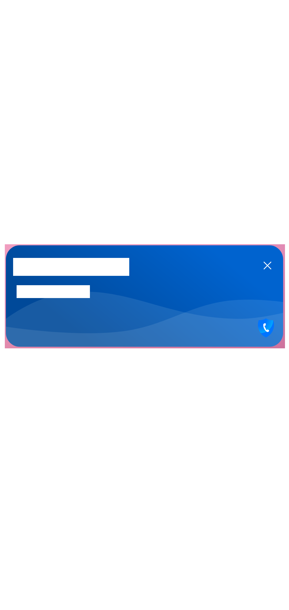 | 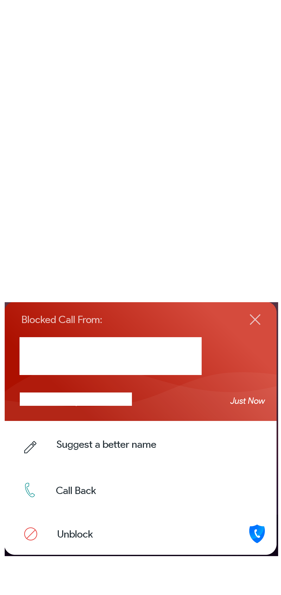 |
|    | com.callapp.contacts                    | CallApp: Caller ID & Recording                     | 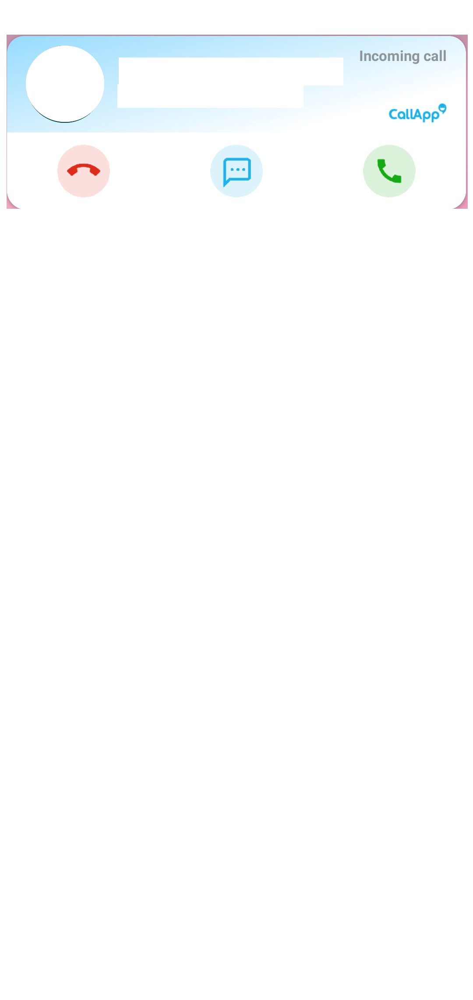                    | 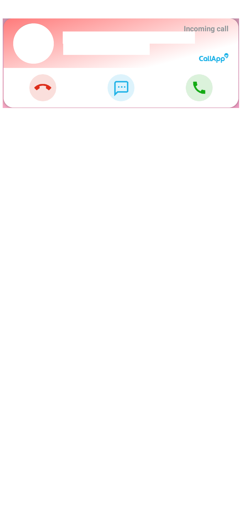                    |
|    | com.unknownphone.callblocker            | Call Blocker - Stop spam calls                     | 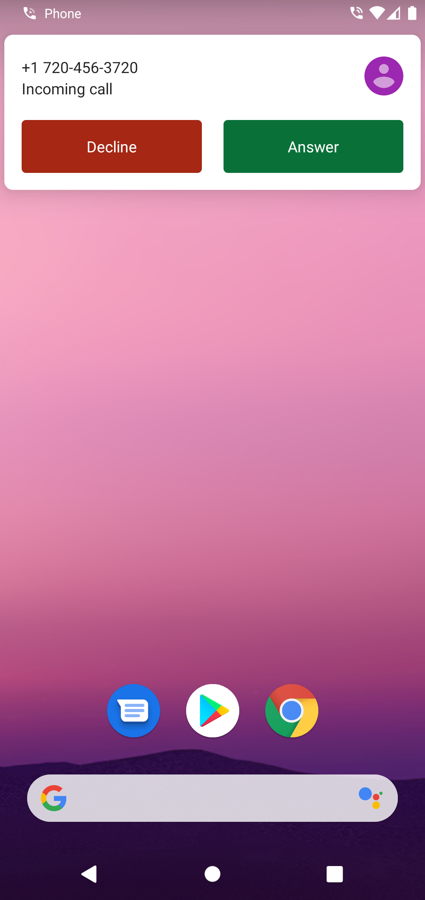            |             |
|    | com.callerid.block                      | Caller ID, Phone Dialer, Block                     | 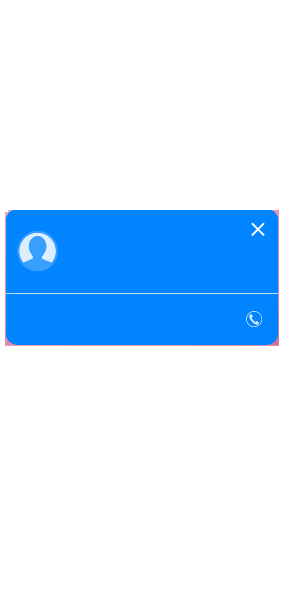                      | 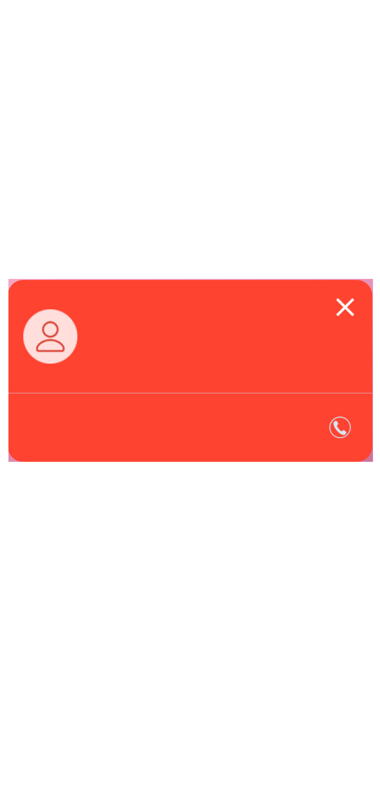                      |
|   | org.mistergroup.shouldianswer           | Should I Answer?                                   |            |            |
|  | com.allinone.callerid                   | Showcaller: Caller ID & Block                      |                    | 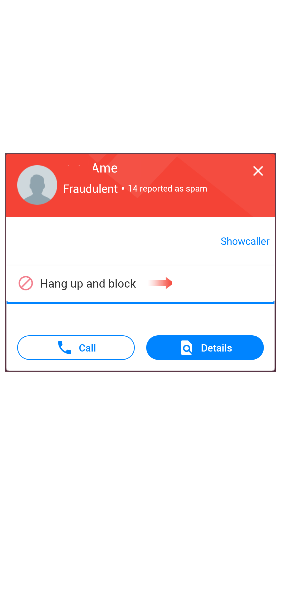                   |
|  | com.mglab.scm                           | Stop Calling Me - Call Blocker                     |                            | 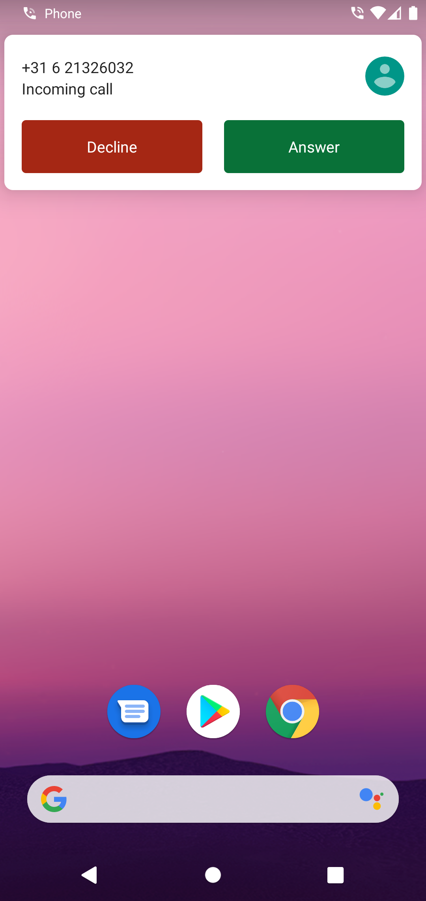                           |
|   | com.telguarder                          | Spam Call Blocker - telGuarder                     | 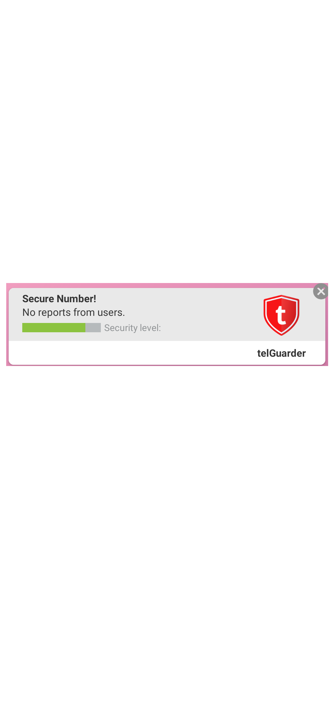                          |                           |
|    | com.truecaller                          | Truecaller: Caller ID & Block                      | 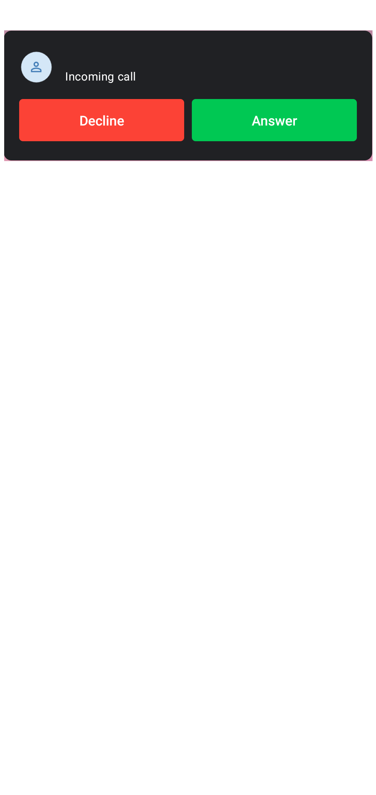                          |                           |
|    | com.webascender.callerid                | Hiya - Call Blocker, Fraud Detection & Caller ID   | 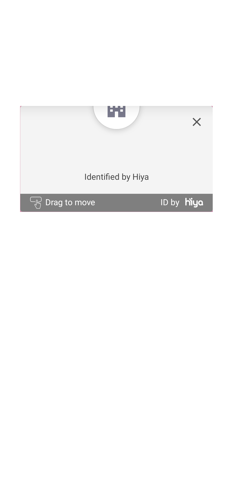                | 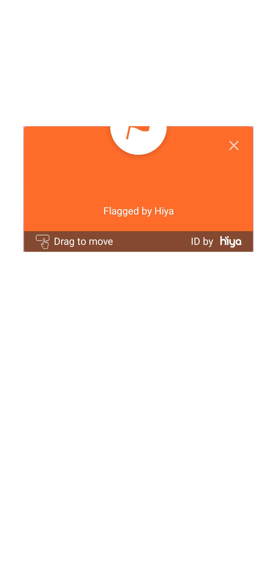                |